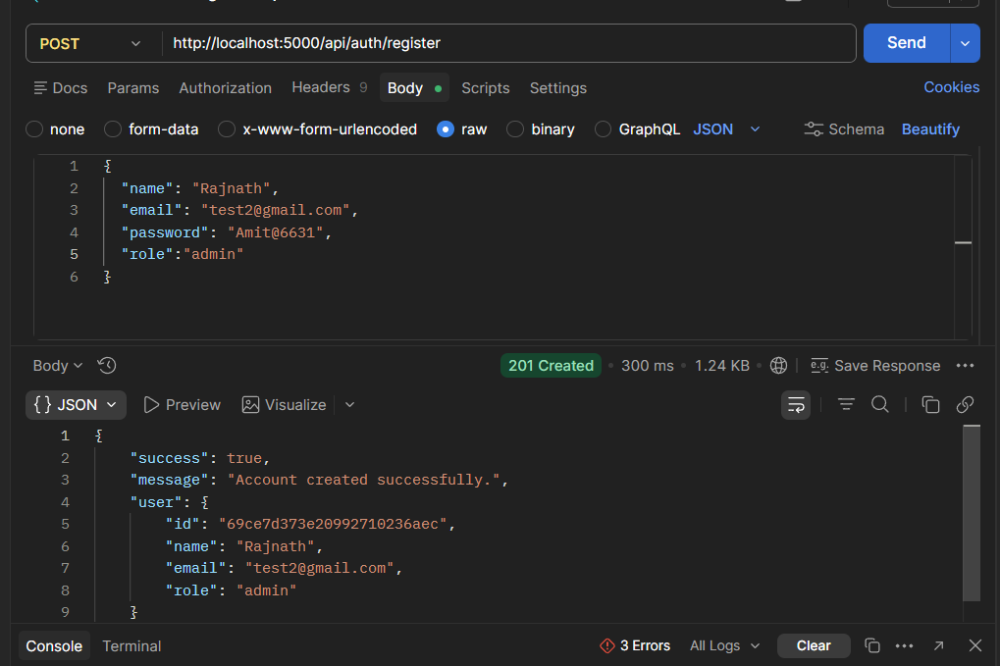
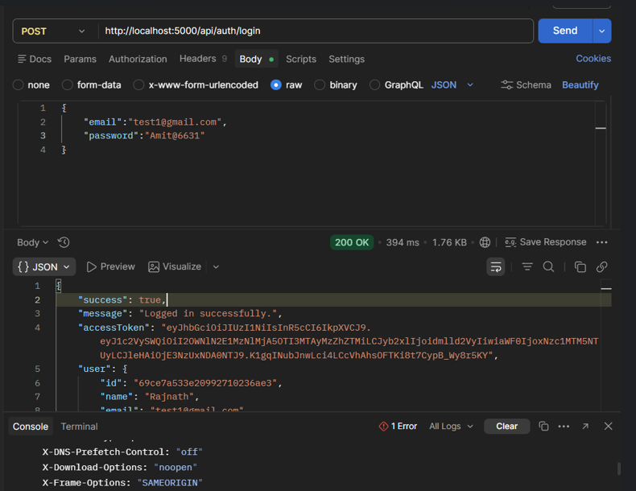
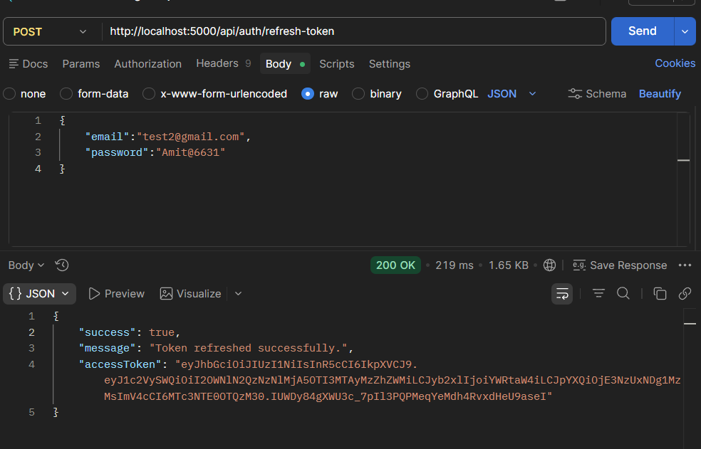
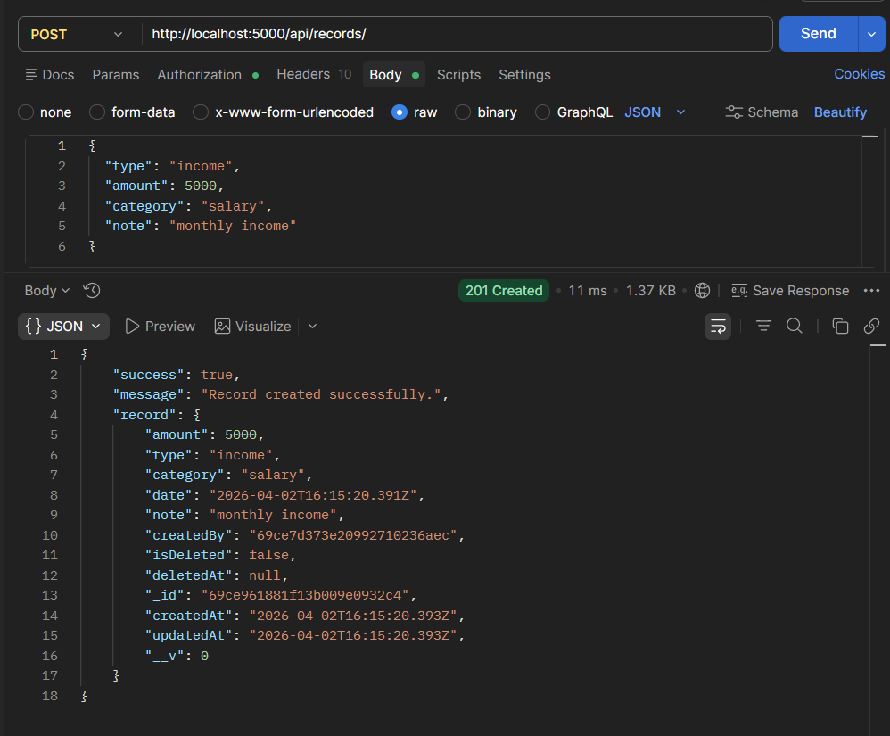
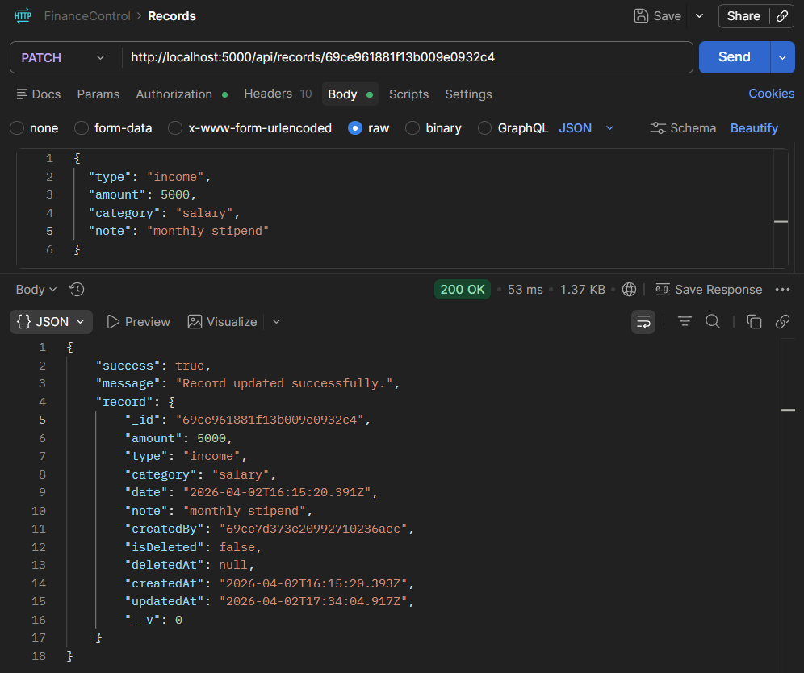
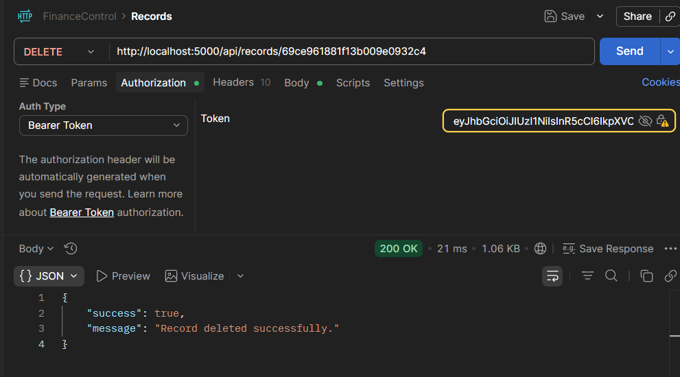
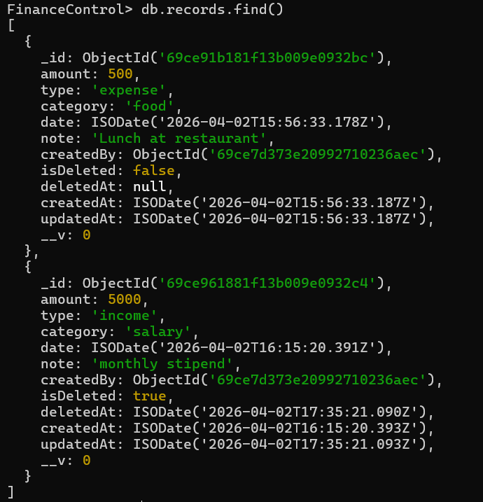
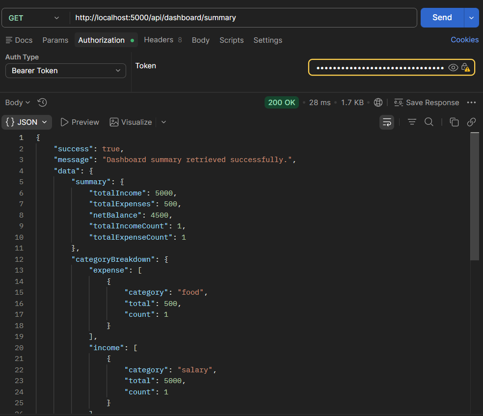

# Finance Control — Backend

A production-grade, secure, and scalable REST API for multi-user financial record management and analytics. Built with Node.js, Express, and MongoDB.

---

## Table of Contents

- [Tech Stack](#tech-stack)
- [Architecture](#architecture)
- [Setup Instructions](#setup-instructions)
- [Environment Variables](#environment-variables)
- [Role Definitions & Permissions](#role-definitions--permissions)
- [API Endpoints](#api-endpoints)
  - [Authentication](#authentication)
  - [Financial Records](#financial-records)
  - [Dashboard Analytics](#dashboard-analytics)
- [Security Features](#security-features)
- [Error Response Format](#error-response-format)
- [Assumptions](#assumptions)

---

## Tech Stack

| Layer          | Technology                     |
| -------------- | ------------------------------ |
| Runtime        | Node.js                 |
| Framework      | Express.js                     |
| Database       | MongoDB + Mongoose              |
| Authentication | JWT (access + refresh tokens)  |
| Validation     | Joi                            |
| Security       | Helmet, CORS, express-mongo-sanitize |
| Rate Limiting  | express-rate-limit             |
| Logging        | Morgan                         |
| Config         | dotenv                         |

---

## Architecture

```
Backend/
├── config/         # Database connection
├── constants/      # Roles, error codes 
├── controllers/    # HTTP request/response handling only
├── services/       # Business logic
├── models/         # Mongoose schemas + instance methods
├── routes/         # Route definitions + middleware chaining
├── middleware/     # auth, RBAC, validation, error handler
├── utils/          # AppError, asyncHandler, jwt, response helpers
├── validations/    # Joi schemas for all inputs
├── app.js          # Express app config, middleware stack
└── server.js       # Entry point, DB connect
```

**Data flow:** `routes → middleware → controllers → services → models → MongoDB`

Controllers are intentionally thin to reduce complexity and increase readability — all business logic lives in services.

---

## Setup Instructions

### Prerequisites

- Node.js 22 
- MongoDB 6+ (local or Atlas)

### 1. Clone and install

```bash
git clone <repo-url>
cd FinanceControl
npm install
```

### 2. Configure environment

```bash
cp .env
# see env.example  for reference
```

### 3. Start the server

```bash
# Development 
npm run dev

# Production
npm start
```

The API will be available at `http://localhost:5000`.

**Server check:** `GET http://localhost:5000/`
**Health check:** `GET http://localhost:5000/health`

---

## Environment Variables

| Variable               | Description                          | Example                          |
| ---------------------- | ------------------------------------ | -------------------------------- |
| `PORT`                 | Server port                          | `5000`                           |
| `MONGO_URI`            | MongoDB connection string            | `mongodb://localhost:27017/ledgerflow` |
| `JWT_ACCESS_SECRET`    | Secret for signing access tokens     | (long random string)             |
| `JWT_REFRESH_SECRET`   | Secret for signing refresh tokens    | (different long random string)   |
| `JWT_ACCESS_EXPIRES_IN`| Access token TTL                     | `15m`                            |
| `JWT_REFRESH_EXPIRES_IN`| Refresh token TTL                   | `7d`                             |
| `NODE_ENV`             | Environment (`development`/`production`) | `development`                |
| `ALLOWED_ORIGINS`      | Comma-separated allowed CORS origins | `http://localhost:3000`          |

> **Never commit `.env` to version control.**

---

## Role Definitions & Permissions

| Role       | Dashboard | View Records | Create/Edit/Delete Records | User Management |
| ---------- | :-------: | :----------: | :------------------------: | :-------------: |
| `viewer`   |    Yes    | No           | No                         | No              |
| `analyst`  |    Yes    | Yes          | No                         | No              |
| `admin`    |    Yes    | Yes            Yes                        | Yes             |

Roles are enforced via `authorizeRoles(...roles)` middleware on each route.

---

## API Endpoints

All endpoints are prefixed with `/api`.

---

### Authentication

#### Register a new user
```
POST /api/auth/register
```
**Body:**
```json
{
  "name": "Jane Doe",
  "email": "test@example.com",
  "password": "Secure1Password",
  "role": "analyst"
}
```
`role` is optional and defaults to `viewer`. Password requires at least 1 uppercase, 1 lowercase, and 1 number.

**Response `201`:**
```json
{
  "success": true,
  "message": "Account created successfully.",
  "user": { "id": "...", "name": "Jane Doe", "email": "test@example.com", "role": "analyst" }
}
```


---

#### Login
```
POST /api/auth/login
```
**Body:**
```json
{ "email": "test@example.com", "password": "Secure1Password" }
```
**Response `200`:**
```json
{
  "success": true,
  "message": "Logged in successfully.",
  "accessToken": "<jwt>",
  "user": { "id": "...", "name": "Jane Doe", "email": "test@example.com", "role": "analyst" }
}
```
A `refreshToken` is set as an **HTTP-only cookie** (scoped to `/api/auth`).


---

#### Refresh Access Token
```
POST /api/auth/refresh-token
```
Reads the `refreshToken` cookie automatically. Returns a new access token and rotates the refresh token cookie.

**Response `200`:**
```json
{ "success": true, "message": "Token refreshed successfully.", "accessToken": "<new-jwt>" }
```

---

#### Logout
```
POST /api/auth/logout
```
**Headers:** `Authorization: Bearer <accessToken>`

Clears the server-side refresh token and the cookie.

---

### Financial Records

All record endpoints require: `Authorization: Bearer <accessToken>`

---

#### Create a record *(Admin only)*
```
POST /api/records
```
**Body:**
```json
{
  "amount": 1500.00,
  "type": "income",
  "category": "Salary",
  "date": "2024-06-01",
  "note": "June salary"
}
```

---

#### Get records *(Admin, Analyst)*
```
GET /api/records
```
**Query Parameters:**

| Param       | Type   | Description                        | Default |
| ----------- | ------ | ---------------------------------- | ------- |
| `page`      | number | Page number                        | `1`     |
| `limit`     | number | Records per page (max 100)         | `10`    |
| `type`      | string | `income` or `expense`              | —       |
| `category`  | string | Filter by category (case-insensitive) | —    |
| `startDate` | ISO date | Range start date                 | —       |
| `endDate`   | ISO date | Range end date                   | —       |
| `search`    | string | Full-text search on `note` field   | —       |
| `sortBy`    | string | `date` or `amount`                 | `date`  |
| `order`     | string | `asc` or `desc`                    | `desc`  |

**Response `200`:**
```json
{
  "success": true,
  "message": "Records retrieved successfully.",
  "records": [...],
  "pagination": {
    "total": 42,
    "totalPages": 5,
    "currentPage": 1,
    "limit": 10,
    "hasNextPage": true,
    "hasPrevPage": false
  }
}
```


---

#### Update a record *(Admin only)*
```
PATCH /api/records/:id
```
Send only the fields to update (partial update supported).


---

#### Delete a record *(Admin only)*
```
DELETE /api/records/:id
```
Performs a **soft delete** — record is marked `isDeleted: true` and excluded from all future queries. Data is preserved in the database.



---

### Dashboard Analytics

#### Get summary *(All roles)*
```
GET /api/dashboard/summary
```
**Headers:** `Authorization: Bearer <accessToken>`

**Response `200`:**
```json
{
  "success": true,
  "message": "Dashboard summary retrieved successfully.",
  "data": {
    "summary": {
      "totalIncome": 15000,
      "totalExpenses": 8200,
      "netBalance": 6800,
      "totalIncomeCount": 12,
      "totalExpenseCount": 34
    },
    "categoryBreakdown": {
      "income": [
        { "category": "Salary", "total": 12000, "count": 6 }
      ],
      "expense": [
        { "category": "Rent", "total": 4200, "count": 6 }
      ]
    },
    "monthlyTrends": [
      { "year": 2024, "month": 1, "income": 3000, "expense": 1400, "net": 1600 }
    ],
    "recentTransactions": [...]
  }
}
```

All analytics are **always scoped to the authenticated user's data** — enforced via `createdBy: userId` in every aggregation `$match`.



---

## Security Features

| Feature                   | Implementation                                                    |
| ------------------------- | ----------------------------------------------------------------- |
| Password hashing          | bcryptjs with salt rounds = 12                                    |
| Access token              | JWT, 15-minute expiry, signed with dedicated secret               |
| Refresh token             | JWT, 7-day expiry, stored as **bcrypt hash** in DB                |
| Token rotation            | Each refresh invalidates the previous token, detects reuse attacks|
| HTTP-only cookies         | Refresh token cookie scoped to `/api/auth`, `sameSite: strict`    |
| NoSQL injection           | express-mongo-sanitize on all request bodies                      |
| Security headers          | helmet() with defaults                                            |
| Rate limiting             | 100 req/15min globally, 20 req/15min on auth routes               |
| CORS                      | Allowlist-based, credentials enabled, configurable via env        |
| Body size limit           | JSON bodies capped at 10kb                                        |
| Data isolation            | `createdBy: userId` filter on every DB query, never optional      |

---

## Error Response Format

All errors follow a consistent structure:

```json
{
  "success": false,
  "message": "Human-readable error message.",
  "errorCode": "MACHINE_READABLE_CODE",
  "details": [
    { "field": "email", "message": "Please provide a valid email address" }
  ]
}
```

`details` is only present for validation errors.

**Error codes:**

| Code                  | Meaning                              |
| --------------------- | ------------------------------------ |
| `VALIDATION_ERROR`    | Invalid request input                |
| `UNAUTHORIZED`        | Missing or invalid authentication    |
| `FORBIDDEN`           | Authenticated but insufficient role  |
| `NOT_FOUND`           | Resource doesn't exist               |
| `CONFLICT`            | Duplicate resource (e.g. email)      |
| `TOKEN_EXPIRED`       | JWT has expired                      |
| `INVALID_TOKEN`       | JWT is malformed or tampered         |
| `INVALID_CREDENTIALS` | Wrong email or password              |
| `INTERNAL_ERROR`      | Unexpected server error              |

---

## Assumptions

1. **Role assignment at registration:** The `role` field is accepted on registration for development convenience. In a production system with admin-only role assignment, this endpoint should be restricted or the role field removed from the public schema.

2. **Soft delete only:** Records are never hard-deleted. This preserves audit history. The `isDeleted` flag is transparently filtered out of all queries via a Mongoose pre-find hook.

3. **Single user per session:** The refresh token mechanism supports one active session per user. Logging in from a second device will invalidate the first session's refresh token.

4. **Token rotation security:** If a refresh token is used more than once (possible token theft), the server detects the reuse, immediately clears the stored token, and forces re-login.

5. **Text search:** Full-text search on `note` requires a MongoDB text index on the `note` field (created automatically by the schema on first sync). For production scale, consider Atlas Search.

6. **Dashboard scope:** The dashboard always returns data for the currently authenticated user only. Admin users do not see aggregated data across all users — this would require a separate admin analytics endpoint.

7. **Monetary precision:** Amounts are stored as JavaScript `Number`. For systems requiring exact decimal arithmetic at scale, consider storing amounts as integers and converting at the API layer.